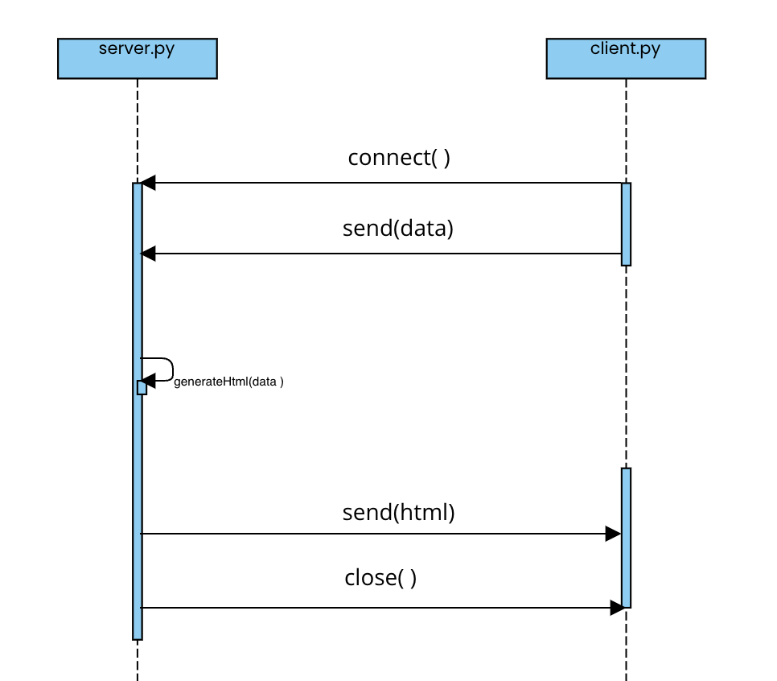

# Email Microservice

This microservice uses a TCP server and client. The client sends the server JSON containing a ledger. The server generates HTML for an email and sends it back to the client. The client can then open email.html and write the returned HTML into it.

# How to programmatically REQUEST data

1. Connect to the server.  
   `s.connect((HOST, PORT))`
2. Convert object to string  
   `json.dumps(ledgerJSON)`
3. Send the ledger  
   `s.send(ledger.encode())`

# How to programmatically RECEIVE data

1. Receive html generated by server  
   `res = clientSocket.recv(2024).decode()`  
   `html += res`

# UML

